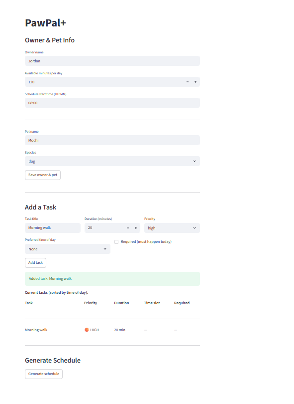

# PawPal+

**PawPal+** is a Streamlit app that helps busy pet owners plan and prioritize their daily pet care. Enter your available time, add tasks with priorities and durations, and the scheduler builds an optimized daily plan — explaining every decision along the way.

## 📸 Demo



## Getting started

### Setup

```bash
python -m venv .venv
source .venv/bin/activate  # Windows: .venv\Scripts\activate
pip install -r requirements.txt
streamlit run app.py
```

## Features

### Priority-based greedy scheduling
`Scheduler.schedule()` builds a daily plan in a single pass through the task list. Tasks are ranked by four criteria in order: required flag first, then priority level (CRITICAL → LOW), then preferred time of day (morning → afternoon → evening), then shortest duration as a tiebreaker. The scheduler fills the owner's time budget greedily — any task that doesn't fit is recorded as skipped with a plain-English reason rather than silently dropped.

### Chronological display sorting
`Scheduler.sort_by_time()` reorders a task list by preferred time slot (morning → afternoon → evening → no preference) independently of scheduling priority. This is used in the UI task table so owners see their day laid out in the natural flow of the day, even if a low-priority morning task would be outranked by a high-priority evening task in the scheduler.

### Recurring task support
Every `PetTask` carries a `frequency` field (`"daily"`, `"weekly"`, `"as_needed"`). `PetTask.is_due_today()` checks whether a task should appear in the current day's pending list based on its frequency and last completion date. When a recurring task is marked complete via `Pet.complete_task()`, a new copy is automatically appended to the pet's task list with `next_due_date` set forward by `timedelta(days=1)` (daily) or `timedelta(days=7)` (weekly), so the next occurrence is always queued without manual re-entry.

### Conflict detection
`Scheduler.detect_conflicts()` scans a single pet's generated schedule for overlapping time windows using the standard half-open interval test (`a.start < b.end AND b.start < a.end`). Adjacent tasks (one ends exactly when the next begins) are not flagged. `Scheduler.detect_cross_pet_conflicts()` extends this to compare scheduled slots across all pets belonging to the same owner — useful when one person cares for multiple animals whose tasks compete for the same time. Both methods return human-readable warning strings rather than raising exceptions, so the UI can display them without crashing.

### Multi-criteria task filtering
`Owner.filter_tasks()` queries all tasks across every pet using any combination of four optional filters: pet name, completion status, priority level, and category string (case-insensitive). All filters are composable — omitting a parameter applies no constraint for that dimension. This powers filtered views in the UI and can be used programmatically in scripts or tests.

### Next available slot (gap-scanning algorithm)
`Scheduler.find_next_available_slot(task, existing_schedule)` answers the question *"When is the earliest opening for this new task, given what is already booked?"*

**Algorithm:**
1. Collect all booked `(start, end)` intervals from `existing_schedule` and sort them by start time.
2. Walk the gaps between consecutive booked blocks. For each gap, check whether it is at least `task.duration_minutes` wide.
3. Return the first qualifying `(start, end)` pair, clamped to start no earlier than the task's preferred time-of-day window (e.g. `"afternoon"` → `12:00`) or the owner's `preferred_schedule_start`.
4. If no gap fits before `21:00`, return `None`.

Unlike the greedy scheduler, this method is a **pure read-only query** — it never modifies the schedule or the budget. It is exposed in the UI as the **"Find Next Available Slot"** panel, letting owners instantly see where a spontaneous new task can be inserted without disrupting the existing plan.

## Agent Mode — how it was used

This feature was designed and implemented in a single Claude Code session using **Agent Mode** (the agentic Claude Code CLI running in VS Code).

**Workflow:**
1. **Codebase exploration** — Claude read `pawpal_system.py`, `app.py`, `main.py`, and `README.md` in parallel to build a full mental model of the existing classes, method signatures, and UI wiring before writing a single line.
2. **Algorithm design** — Claude identified that the existing scheduler only builds a plan in one greedy pass and has no way to answer "where does a *new* task fit in a plan that already exists?" It designed the gap-scanning approach (sort booked intervals → walk gaps → return first fit) as a clean complement to the existing logic, reusing the private `_add_minutes` helper and the `TIME_SLOTS` dict already on the class.
3. **Multi-file editing** — Claude made coordinated edits across four files (`pawpal_system.py`, `app.py`, `main.py`, `README.md`) in one session without losing context between files, which would be error-prone when done manually.
4. **Helper extraction** — Claude noticed that the new algorithm needed a `_minutes_between` utility not yet on the class, added it as a static method in the right private-helper section, and wired it into the new public method — all without duplicating logic already handled by `_add_minutes`.
5. **UI integration** — Claude added a self-contained "Find Next Available Slot" panel to `app.py` that reuses existing `PRIORITY_MAP` / `TIME_OPTIONS` patterns and only appears after a schedule has been generated, matching the progressive-disclosure style of the rest of the UI.

## Testing PawPal+

All tests live in a single file: `tests/test_pawpal.py`.

### Running the tests

```bash
python -m pytest
```

All 60 tests should pass. For verbose output showing each test name:

```bash
python -m pytest -v
```

### What is tested

The suite is organised into seven test classes (60 tests total):

| Class | Tests | What it covers |
|---|---|---|
| `TestPetTask` | 5 | `mark_complete`, `mark_incomplete`, `to_dict` keys/types, unique IDs |
| `TestPet` | 8 | `add_task`, `remove_task`, priority ordering, pending queries, `reset_completion` |
| `TestOwner` | 8 | Pet roster management, `set_availability` (including negative-value guard), `get_all_tasks` |
| `TestSortByTime` | 5 | Chronological order (morning → afternoon → evening → no preference), tiebreaker by duration, list immutability |
| `TestRecurrence` | 11 | Daily/weekly next-occurrence dates, `completed=False` on new copy, `as_needed` returns `None`, 6-vs-7-day weekly boundary |
| `TestConflictDetection` | 7 | Identical/overlapping times flagged, adjacent tasks not flagged, cross-pet overlap detection, no double-reporting |
| `TestScheduleHappyPath` | 16 | Budget enforcement, skip tracking, required-before-optional ordering, time-slot preference, sequential task times, reasoning summary |

### Confidence Level

**4 / 5 stars**

All 60 tests pass, covering the core scheduling logic end-to-end — sorting, recurrence, conflict detection, and budget-based scheduling — with both happy-path and edge-case scenarios (adjacent task boundaries, 6-vs-7-day weekly cutoffs, `as_needed` tasks, empty rosters, negative availability).

One star is withheld because the Streamlit UI (`app.py`) has no automated test coverage. Session state persistence across re-renders, form validation (blank task title, malformed `HH:MM` input), and visual rendering are untested and could fail silently in the browser.
